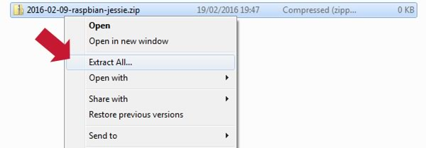
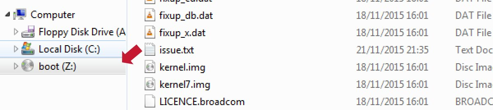
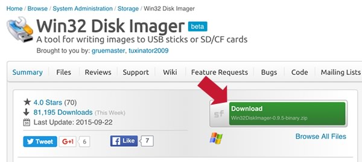
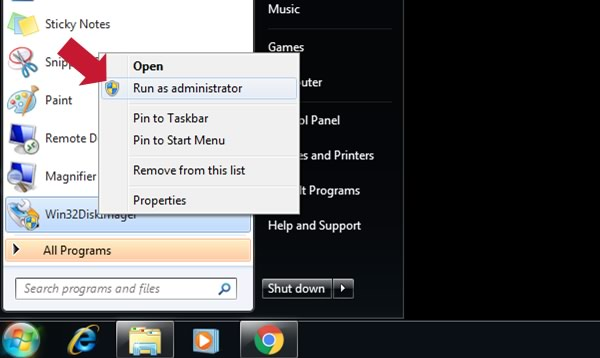

# Installing Operating System Images Using Windows

## Downloading An Image

Head to the [downloads page](https://www.raspberrypi.org/downloads/) and pick your desired operating system.

Note: These can vary dramatically in size. The latest Raspbian is a 1.4GB download.

Extract the downloaded Zip file by right clicking on it and choosing "Extract All"

## Find your SD card

Insert the SD card into your SD card reader. This can either be an SD card slot in your computer, or a cheap SD card adaptor plugged into a USB port.

You should see a new drive letter pop up in the left column of Windows Explorer. This is the drive you must select in Win32DiskImager.

## Download Win32DiskImager

If you already have Win32DiskImager installed you can start it and skip to "Install The Image".

You'll need to download the free Win32DiskImager from its [Sourceforge Project page](http://sourceforge.net/projects/win32diskimager/)

Click on the downloaded installer and run it, you may see warnings about an Unknown Publisher. In this case, it's safe to ignore these!

At the end of the installation, uncheck "Launch Win32DiskImager" and click Finish.

To start Win32DiskImager you will have to locate it in your start menu, right click, and choose **"Run As Administrator"**

## Install The Image

Select the drive letter of the SD card in the device box in Win32DiskImager.

Be careful to select the correct drive; if you get the wrong one you can destroy your data on the computer's hard disk! If you are using an SD card slot in your computer and can't see the drive in the Win32DiskImager window, try using a cheap SD adaptor in a USB port.

- Click `Write` and wait for the write to complete. This could take a long time.
- Exit the imager and eject the SD card.

---

*This article uses content from the eLinux wiki page [RPi_Easy_SD_Card_Setup](http://elinux.org/RPi_Easy_SD_Card_Setup), which is shared under the [Creative Commons Attribution-ShareAlike 3.0 Unported license](http://creativecommons.org/licenses/by-sa/3.0/)*
